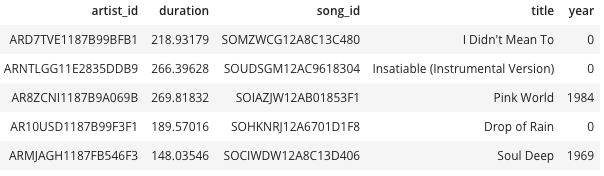

# Data modeling with Postgres and build an ETL pipeline using Python
## Introduction 

A startup called Sparkify collected the data on songs and user activities, they are interested to have insight on the data which is collected in json format

## Description 
Read the data which is in JSON format, create ETL pipeline and insert data in appropriate tables in Postgres.

## Data sources
- songs data set <https://labrosa.ee.columbia.edu/millionsong/>
- logs data set: <https://github.com/Interana/eventsim>

## Database schema 

### Table views
#### Fact Table
##### Songplays

#### Dimension table
##### Songs

##### Users

##### Artists

##### Time

## Project files

- 'create_tables.py': It drops all the table, run this file before running "etl.ipynb"
- 'etl.ipynb': Read one record from the data source, create all tables and insert one record.
- 'test.ipynb': execute some query to check if data is inserted in table correctly, 
- 'etl.py': read all the data from data source and insert to respective folders
- 'sql_queries.py': incluce all queries to create and drop tables, inserting data to the tables
- 'README.md': project info.

## Project Steps
1. First run the "create_tables.py" to reset the tables, if running first time, comment the drop queries.
2. Run the etl.ipynb to see for dataframe of each table and inserting one record
3. Run etl.py to insert all the data to the database.
4. User test.ipynb to see if data inserted correctly
